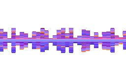

  

  

---

  Desenvolvedor Full Stack com paixão por tecnologia e esportes.

---

### 👨‍💼 Sobre mim

Sou estudante de **Análise e Desenvolvimento de Sistemas** pela UNIP - São José dos Campos. Atuo como desenvolvedor **Full Stack**, com experiência sólida em diversas linguagens e tecnologias do mercado.

Busco constantemente evoluir como profissional, aprimorando minhas habilidades técnicas e participando de projetos que tragam impacto e aprendizado.

---

### 💻 Tecnologias principais

### 🧰 Outras tecnologias e ferramentas

---

### 🎓 Formação

- **Análise e Desenvolvimento de Sistemas** — UNIP (em andamento)  
  Local: São José dos Campos - SP

---

### 🌐 Redes sociais

---

### ⚽ Curiosidades

Fora da tecnologia, sou apaixonado por **esportes**, tanto acompanhando quanto praticando. Acredito no equilíbrio entre mente ativa e corpo saudável.

---

  

---

  <em>"Grandes resultados vêm de pequenos esforços diários."</em>

